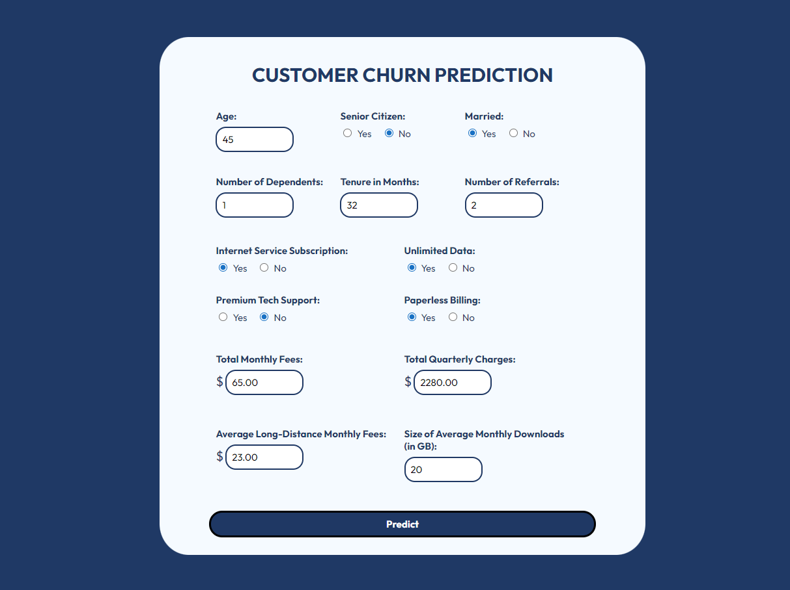

# Predicting Customer Churn for TrustTelecom
## ⭐ Overview 
This project builds a **machine learning classifier** to **predict customer churn** for a telecommunications company, **TrustTelecom**. The best-performing model is deployed using a Flask API in Docker, which allows end users to interact with it through a **web form built with HTML and CSS**.

This project was completed as part of an **AI deployment course** in a pairwork setting. The model was previously hosted on **AWS EC2** for grading purposes.

---

### Repository Structure
- 🥬 `notebooks/research.ipynb` - contains analysis and model
- 🥬 `notebooks/api_query.ipynb` - example query using API call
- 🫓 `src/model.py` - loads exported Model using `joblib` for predictions
- 🫓 `src/app.py` - details main app logic for requests made via UI Form and API calls
- 🫓 `src/input_processing.py` - validates and formats the necessary model inputs from form responses
- 🍞 `requirements.txt ` - lists required packages

---

## ⭐ Model Selection and Results
### Selected Model: CatBoost Classifier with Hyperparameter Tuning
We selected our features through a mix of **correlation analysis** and **exploratory data analysis**, arriving at the final set of 14 features:
1. `age`
2. `senior_citizen`
3. `married`
4. `num_dependents`
5. `tenure_months`
6. `num_referrals`
7. `paperless_billing`
8. `has_internet_service`
9. `has_unlimited_data`
10. `has_premium_tech_support`
11. `total_monthly_fee`
12. `total_charges_quarter`
13. `avg_long_distance_fee_monthly`
14. `avg_gb_download_monthly`

We experimented with different classifiers (_Logistic Regression, Random Forest Classifier, Gradient Boosting Classifier, XGBoost, CatBoost_), picked the model with the best AUC score, which was the **`CatBoost Classifier`** at **0.8792**.

We then performed **hyperparameter tuning using GridSearchCV** to **optimise** the AUC score, arriving at a final score of **0.8809**.
- Best Parameters: `depth`: 4, `iterations`: 100, `l2_leaf_reg`: 1, `learning_rate`: 0.1

---
## Data Source
The original dataset was provided as part of the course and is not publicly available. You can download the sample dataset [here](https://drive.google.com/file/d/16or9tsk2n91qGXstOOtlHCIlhkkE_NZo/view?usp=sharing)

---

## ⭐ How to Run
### 1. Clone this repository
```bash
git clone https://github.com/dorcasshee/customer-churn-prediction.git
cd customer-churn-prediction
```
### 2. [Optional] Create a virtual environment
You may want to use a virtual environment for dependency management. You can run the following commands to create and activate a new virtual environment:
```powershell
python -m venv [venvName] # only run once
[venvName]\Scripts\activate # windows
```
Replace `[venvName]` with your desired virtual environment name. E.g., `cust-churn`.

### 3. [Recommended] Upgrade `pip`
```powershell
python -m pip install --upgrade pip
```

### 4. Install dependencies
```powershell
pip install -r requirements.txt
```
This might take a few minutes.  
**Note**: You can run this in Visual Studio Code (VSC). Please ensure you have the Jupyter extension in VSC.

### 5. Run the Flask app
```powershell
python src\app.py
```

### 6. Access the web app
You can access the web app at http://localhost:5000.  
You should see a web form like this:



### 7. [Optional] Deactivate the virtual environment
```powershell
deactivate
```

---

## ⭐ Let's Connect!
Thanks for checking out this project!  
If you have any questions, feedback, or collaboration opportunities, feel free to reach out!  

🔗 **LinkedIn:** https://www.linkedin.com/in/dorcasshee/  
📧 **Email:** dorcasshee@outlook.com